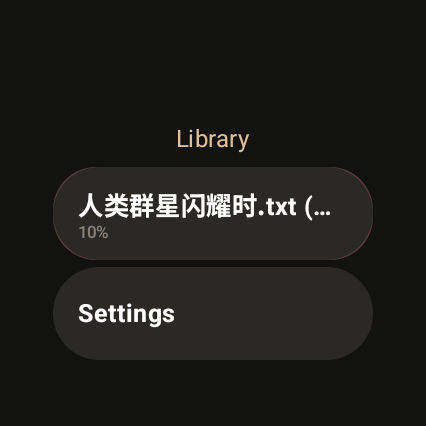
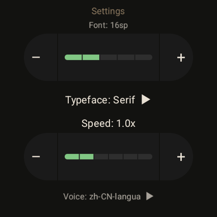

# WatchReader

A minimalist e-book reader for Wear OS. Send books from your phone and read them on your watch.

<p align="center">
  
  
  
</p>

## Features

- **Supports .txt and .epub** — Epub is parsed to text on the phone before syncing
- **Phone-to-watch transfer** — Add books on the phone app, they sync to your watch instantly
- **Smart pagination** — Automatic page breaks at sentence/paragraph boundaries, optimized for round screens
- **Text-to-speech** — Long press to open TTS controls, auto-detects Chinese/English and switches voices
- **Rotary crown** — Turn the crown to flip pages (reader) or scroll (library/settings)
- **Tap navigation** — Tap left/right thirds to go back/forward, center to toggle toolbar
- **Swipe to delete** — Swipe left on a book to remove it
- **Customizable** — Font size, typeface (Sans/Serif), TTS voice & speed

## Architecture

```
WatchReader/
├── mobile/          # Phone companion app (add & send books)
├── wear/            # Wear OS reader app
│   ├── ui/          # Compose screens (Library, Reader, Settings)
│   ├── tts/         # TTS with sentence highlighting & language detection
│   └── data/        # Room database + repository
└── shared/          # Cross-module models (BookMetadata, ReadingProgress)
```

## Build

```bash
./gradlew :wear:assembleDebug
./gradlew :mobile:assembleDebug
```

Install to watch via ADB:
```bash
adb connect <watch-ip>:<port>
adb install wear/build/outputs/apk/debug/wear-debug.apk
```

## Requirements

- Wear OS 3+ (API 30+)
- Phone app requires Google Play Services for Wearable Data Layer
