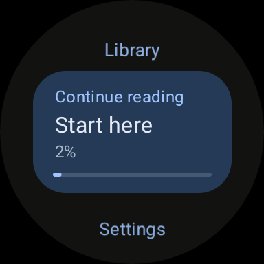
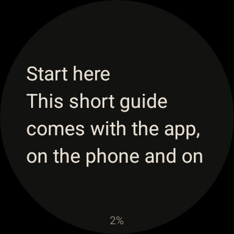
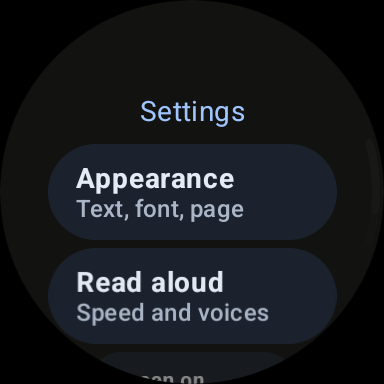
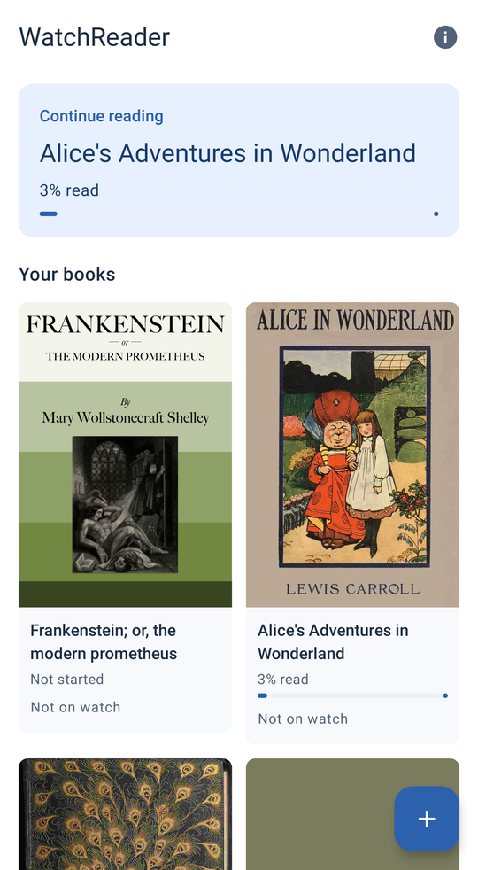
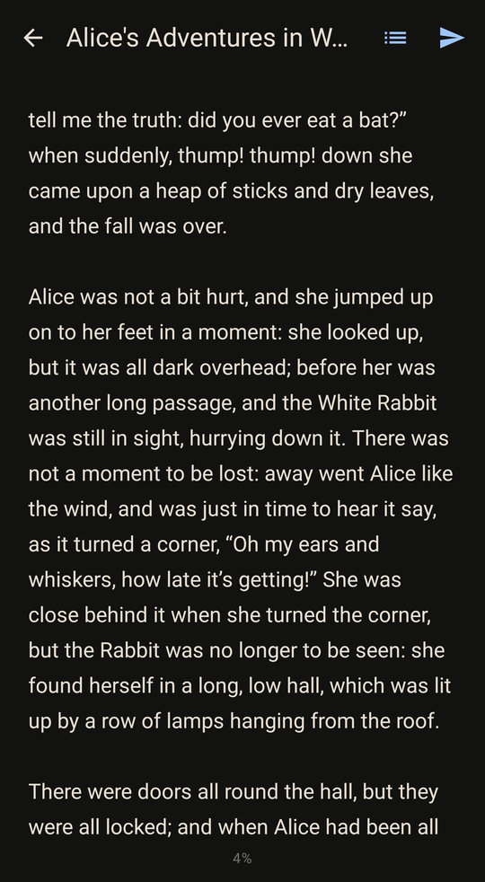
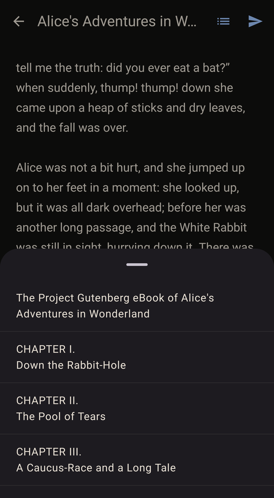

# WatchReader

A minimalist e-book reader for Wear OS. Add a book on your phone, read it on your watch or on the phone itself, or let the watch read it aloud.

[**Get it on Google Play**](https://play.google.com/store/apps/details?id=com.watchreader)

<p align="center">
  
  
  
</p>

<p align="center">
  
  
  
</p>

## Features

- **.txt and .epub** — epub is unpacked on the phone, along with its cover art and its own table of contents; text encodings (UTF-8, GBK, GB18030, byte-order marks) are detected there too, so the watch only ever stores UTF-8
- **Phone-to-watch transfer** — one channel per book with the metadata in the stream; the watch confirms with a receipt, and the phone only talks to a watch that actually runs the app
- **Measured pagination** — each page is laid out against the real page box with a `TextMeasurer`, found by binary search and snapped to a paragraph, sentence or phrase; only the pages you look at are ever measured, so a long novel opens at 90% instantly. On the round screen the page is a left-aligned block inscribed in the circle, so no line is clipped and no line is centred against the one above it
- **Read on the phone as well** — the same paginator drives a phone reader: tap the halves to turn pages, jump by chapter from the contents sheet, and send the book on from the button in the top right
- **Read aloud** — a foreground media service reads the book with the watch's TTS engine, sentence by sentence with Chinese/English detection, and keeps going with the screen off or after you leave the reader; the reader follows along and highlights the sentence
- **Rotary crown** — one page per detent in the reader, scrolling in lists
- **Progress both ways** — whichever device you read on keeps the place, and the other one is told; the later timestamp wins
- **Share to WatchReader** — from a file manager, browser or mail client, or paste a link
- **Settings** — font size, three typefaces (sans, serif, bundled 楷体 LXGW WenKai), dark or sepia page, keep-screen-on, speech rate and voice

## Architecture

```
WatchReader/
├── shared/          # Wire format: metadata header + text, receipts, progress; charset detection
│   └── reader/      # PageGeometry and Paginator, used by both apps (pure Kotlin, unit tested)
├── mobile/          # Phone app: library, import (file, share, URL), reader, sender, receipts
└── wear/            # Watch app
    ├── service/     # BookReceiverService (Data Layer), TtsService (foreground read-aloud)
    ├── tts/         # Sentence splitting, language detection, playback state
    ├── ui/          # Compose screens: Library, Reader, Settings
    └── data/        # Room database + repository
```

Both modules ship the same `applicationId`, because Play wants every bundle of one listing to carry it; the watch bundle is told apart by `uses-feature android.hardware.type.watch` in its manifest.

## Build

Requires JDK 17 (`org.gradle.java.home` in `~/.gradle/gradle.properties`) and the Android SDK.

```bash
./gradlew test                      # unit tests in all three modules
./gradlew :wear:assembleDebug :mobile:assembleDebug
```

Install to the watch over ADB:

```bash
adb connect <watch-ip>:<port>
adb -s <watch> install -r wear/build/outputs/apk/debug/wear-debug.apk
```

## Release

Release builds are signed with a keystore that is never committed. Put it at the repository root and its credentials in `local.properties`:

```
RELEASE_STORE_FILE=watchreader-release.keystore
RELEASE_STORE_PASSWORD=...
RELEASE_KEY_ALIAS=watchreader
RELEASE_KEY_PASSWORD=...
```

Then:

```bash
./gradlew :wear:bundleRelease :mobile:bundleRelease
```

The version is defined once in the root `build.gradle.kts` (`verMajor`/`verMinor`/`verPatch`); the phone bundle's `versionCode` ends in 1 and the watch bundle's in 2, because Play needs every bundle of one app to carry a distinct code. Store listing text and changelogs live in `fastlane/metadata/android/`, the privacy policy in `docs/`, icon, feature graphic and store screenshots in `store-assets/`.

Resource shrinking is on for release builds, and `android_wear_capabilities` is only ever read by name, from Play services rather than from our own code. Both modules therefore keep it alive with a `res/raw/keep.xml`; without that the release build advertises no capability and the two apps cannot find each other at all.

The watch reads books aloud from a `mediaPlayback` foreground service, so Play's App content section asks for a
foreground service permissions declaration, and that declaration will not save without a link to a video showing the
feature in use. A screen recording of the watch is enough; note that `adb screenrecord` on Wear OS captures the screen
only, so the recording is silent.

Play wants a Wear OS bundle on its own track. A version goes out as two production releases: the phone bundle on the Phones track and the watch bundle on the Wear OS track, each sent for review separately. Publishing only to the Wear OS internal testing track does not put the watch app in front of buyers.

## Requirements

- Watch: Wear OS 3+ (API 30+); the watch app is not standalone, books come from the phone app
- Phone: Android 11+ with Google Play services (Wearable Data Layer)

## Bundled fonts

楷体 uses [LXGW WenKai](https://github.com/lxgw/LxgwWenKai-Lite) Lite Regular, subsetted to GB2312 + ASCII (~3.5MB), under the [SIL Open Font License 1.1](licenses/LXGWWenKai-OFL.txt).

## License

MIT, see [LICENSE](LICENSE).
