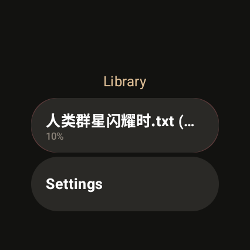
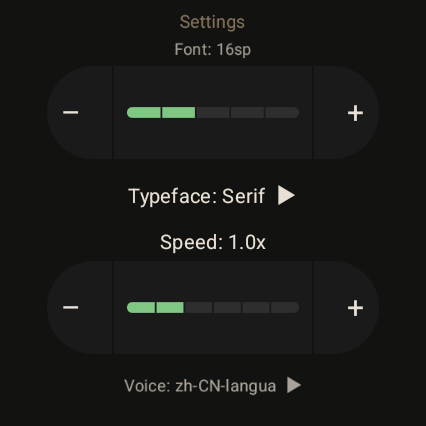

# WatchReader

A minimalist e-book reader for Wear OS. Add books on your phone, read them on your watch, or let the watch read them aloud.

<p align="center">
  
  
  
</p>

## Features

- **.txt and .epub** — epub is unpacked on the phone; text encodings (UTF-8, GBK, GB18030, byte-order marks) are detected there too, so the watch only ever stores UTF-8
- **Phone-to-watch transfer** — one channel per book with the metadata in the stream; the watch confirms with a receipt, and the phone only talks to a watch that actually runs the app
- **Measured pagination** — each page is laid out against the real page box with a `TextMeasurer`, found by binary search and snapped to a paragraph, sentence or phrase; only the pages you look at are ever measured, so a long novel opens at 90% instantly. On a round screen the page is the inscribed rectangle, so no corner is clipped
- **Read aloud** — a foreground media service reads the book with the watch's TTS engine, sentence by sentence with Chinese/English detection, and keeps going with the screen off; the reader follows along and highlights the sentence
- **Rotary crown** — pages in the reader, scrolling in lists
- **Progress both ways** — the watch keeps your place and mirrors it to the phone's book covers
- **Share to WatchReader** — from a file manager, browser or mail client, or paste a link
- **Settings** — font size, three typefaces (sans, serif, bundled 楷体 LXGW WenKai), dark or sepia page, keep-screen-on, speech rate and voice
- English and Simplified Chinese UI

## Architecture

```
WatchReader/
├── shared/          # Wire format: metadata header + text, receipts, progress; charset detection
├── mobile/          # Phone app: library, import (file, share, URL), sender, receipts
└── wear/            # Watch app
    ├── reader/      # Paginator (pure Kotlin, unit tested)
    ├── service/     # BookReceiverService (Data Layer), TtsService (foreground read-aloud)
    ├── tts/         # Sentence splitting, language detection, playback state
    ├── ui/          # Compose screens: Library, Reader, Settings
    └── data/        # Room database + repository
```

## Build

Requires JDK 17 (`org.gradle.java.home` in `~/.gradle/gradle.properties`) and the Android SDK.

```bash
./gradlew test                      # unit tests in all three modules
./gradlew :wear:assembleDebug :mobile:assembleDebug
```

Install to the watch over ADB:

```bash
adb connect <watch-ip>:<port>
adb -s <watch> install -r wear/build/outputs/apk/debug/wear-debug.apk
```

## Release

Release builds are signed with a keystore that is never committed. Put it at the repository root and its credentials in `local.properties`:

```
RELEASE_STORE_FILE=watchreader-release.keystore
RELEASE_STORE_PASSWORD=...
RELEASE_KEY_ALIAS=watchreader
RELEASE_KEY_PASSWORD=...
```

Then:

```bash
./gradlew :wear:bundleRelease :mobile:bundleRelease
```

The version is defined once in the root `build.gradle.kts` (`verMajor`/`verMinor`/`verPatch`); the phone bundle's `versionCode` ends in 1 and the watch bundle's in 2, because Play needs every bundle of one app to carry a distinct code. Store listing text and changelogs live in `fastlane/metadata/android/`, the privacy policy in `docs/`, icon and feature graphic in `store-assets/`.

## Requirements

- Watch: Wear OS 3+ (API 30+); the watch app is not standalone, books come from the phone app
- Phone: Android 11+ with Google Play services (Wearable Data Layer)

## Bundled fonts

楷体 uses [LXGW WenKai](https://github.com/lxgw/LxgwWenKai-Lite) Lite Regular, subsetted to GB2312 + ASCII (~3.5MB), under the [SIL Open Font License 1.1](licenses/LXGWWenKai-OFL.txt).

## License

MIT, see [LICENSE](LICENSE).
